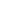
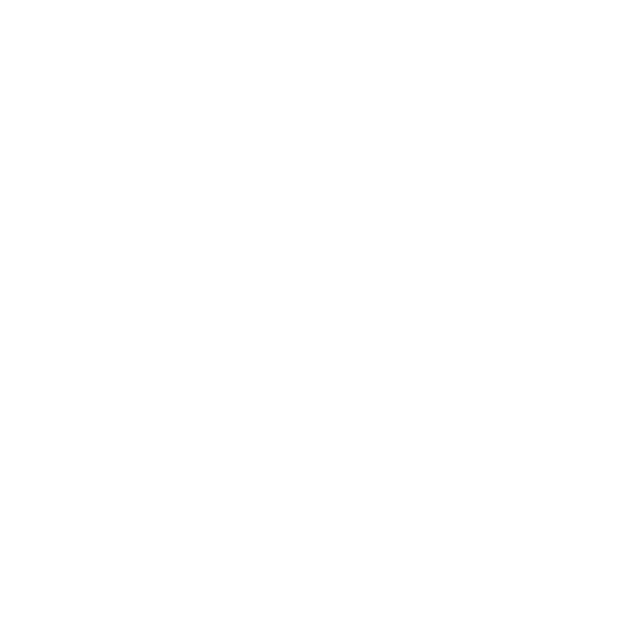
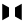
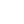

# Advanced

The five capabilities in this chapter sit on top of the basic edit loop. You can author a usable tile without ever touching them — but they are what turn a slow, repetitive workflow into a fast one.

- [Selection](#selection) — pick a region of voxels for bulk operations
- [Transform](#transform) — move, rotate, scale, flip, and mirror selections
- [Symmetry](#symmetry) — auto-mirror every edit in real time
- [Procedural Shader](#procedural-shader) — generate voxels from a GDScript expression
- [Spawn Points](#spawn-points) — place metadata for the host game

---

## Selection {#selection}

Press <kbd>S</kbd> or click the  Select button to enter Select mode. The sub-tools area changes to show four selection methods. Pick one, build a selection by clicking in the viewport, and the **Transform bar** (right of the viewport) lights up.

Selected voxels are drawn with a cyan wireframe overlay.

### The four selection sub-tools

| | Tool | Behaviour |
|---|---|---|
|  | **Face** (Magic) | Click a voxel — flood-selects all voxels reachable along the *exposed* face you clicked. Stops at any face that's hidden behind another voxel. The right tool for "select this whole wall surface but not the wall behind it" |
|  | **Rect** (Box) | Click two corners of a 3D box. Everything inside the box — air or solid — is selected |
|  | **Brush** | Click and drag with a circular brush; voxels under the brush join the selection. Brush size is set in the context bar (1–16) |
|  | **Object** | Click any voxel — selects the entire 6-connected blob it belongs to. The right tool for "grab this whole connected piece" |

### Adjusting an existing selection

| Action | How |
|---|---|
| Add to selection | Hold <kbd>Shift</kbd> while clicking with any selection sub-tool |
| Remove from selection | Hold <kbd>Alt</kbd> while clicking with any selection sub-tool — works as a "selection eyedropper" |
| Replace selection | Click without modifiers — the new selection replaces the old one |
| Clear selection | <kbd>Esc</kbd> with no other action in progress |
| Select all | <kbd>Ctrl</kbd>+<kbd>A</kbd> — selects every non-air voxel in the tile |

### Selection-with-filters

In the context bar you'll find three filter buttons that constrain Face / Object selections to voxels with matching attributes:

| Filter | Effect |
|---|---|
| **Geo** | (Default) Any 6-connected voxel counts as part of the blob |
| **Material** | Only voxels with the same base material type (stone, water, …) join the selection |
| **Color** | Only voxels with the same palette index join the selection |

For Brush mode, the **Brush Size** spinner sets the circle radius (1–16).

### What you can do with a selection

Once you have a selection, the Edit menu and the Transform bar offer a long list of operations. The Edit menu shortcuts:

| Operation | Shortcut | Effect |
|---|---|---|
| Copy | <kbd>Ctrl</kbd>+<kbd>C</kbd> | Copy selected voxels to the clipboard |
| Cut | <kbd>Ctrl</kbd>+<kbd>X</kbd> | Copy + delete |
| Paste | <kbd>Ctrl</kbd>+<kbd>V</kbd> | Enters **paste mode** — see below |
| Delete | <kbd>Del</kbd> | Remove selected voxels |
| Select All | <kbd>Ctrl</kbd>+<kbd>A</kbd> | Select every non-air voxel |

### Paste mode

After <kbd>Ctrl</kbd>+<kbd>V</kbd>, the clipboard's voxels appear as a floating preview that follows the cursor. The voxels are not yet committed.

| Action | Effect |
|---|---|
| Move mouse | The preview follows |
| Click | Commit the paste at the current preview location |
| <kbd>Esc</kbd> | Cancel — the preview is discarded |

The paste anchors to the same face logic as Add — it lands on the voxel face you click, or on Y = 0 if you click empty space.

---

## Transform {#transform}

When a selection exists, the **Transform bar** runs vertically along the right edge of the viewport. Buttons activate gizmos in the viewport — drag the gizmo handles to perform the transform interactively.

| | Button | Behaviour |
|---|---|---|
|  | **Move** | Three axis arrows + three plane handles + a centre handle. Drag an arrow for axis-locked movement; drag a plane handle for two-axis movement; drag the centre for free movement |
|  | **Rotate** | Three coloured rings (red = X, green = Y, blue = Z). Drag a ring to rotate around its axis. Hold <kbd>Shift</kbd> to snap to 45° increments |
|  | **Scale** | Cube handles at corners and edges. Drag a corner for uniform scale; drag an edge handle to stretch along one axis |
|  | **Flip** | Pop-up menu with X / Y / Z. Mirrors the selection within its current bounding box. Doesn't change position |
|  | **Mirror** | Pop-up menu with X / Y / Z. *Duplicates* the selection and flips the duplicate. Original stays. Result is symmetric around the selection centre |
|  | **Hollow** | Removes interior voxels from the selection. Only voxels with at least one exposed face survive |
|  | **Flood** | Fills enclosed air pockets inside the selection's bounding box with the active palette colour |

### Confirming and cancelling

A transform is **not committed** the moment you stop dragging. The viewport stays in a pending-transform state — you can keep adjusting until you commit.

| Key | Effect |
|---|---|
| <kbd>Enter</kbd> | Commit the pending transform |
| <kbd>Esc</kbd> | Cancel — voxels snap back to their original position |
| Arrow keys | Nudge the selection one voxel at a time on the X / Z axes. <kbd>Shift</kbd>+arrow nudges on Y |

This commit-then-keep-editing model makes precision fixes easy: hit Move, drag roughly to the right area, then nudge into place with arrow keys before committing.

### Selection menu transforms (no gizmo)

For one-shot transforms the Selection menu offers direct commands without going through the gizmo:

| Command | What it does |
|---|---|
| **Rotate X / Y / Z** | 90° rotation around the selection centre on the chosen axis |
| **Flip X / Y / Z** | Mirror within the selection bounds |
| **Mirror X / Y / Z** | Duplicate-and-flip — keeps the original |
| **Scale 0.5× / 0.75× / 2× / 3× / 4×** | Resample the selection |
| **Hollow** | Remove interior voxels |
| **Flood Interior** | Fill enclosed air |
| **Dilate** | Grow the selection outward by 1 voxel |
| **Erode** | Shrink the selection inward by 1 voxel |

These commit immediately — there's no gizmo phase.

{: .tip }
> **Dilate** + **Erode** are the easiest way to clean up rough geometry. Erode→Dilate strips off thin protrusions; Dilate→Erode fills small holes.

---

## Symmetry {#symmetry}

Symmetry runs your edits through one or more mirror planes in real time. Place a single voxel on the left side of the tile with X-symmetry on, and a matching voxel appears on the right.

### The three axis planes

Three buttons sit just below the main mode buttons on the left sidebar:

| Button | Plane | What it mirrors |
|---|---|---|
| **X** | YZ at tile centre X | Left ↔ right |
| **Y** | XZ at tile centre Y | Top ↔ bottom |
| **Z** | XY at tile centre Z | Front ↔ back |

Toggle each independently — multiple can be active at once. With X + Z both on, every edit is replicated four times (origin + X mirror + Z mirror + both).

The active planes are drawn as translucent coloured rectangles in the viewport: red for X, green for Y, blue for Z.

### Custom mirror planes

The three axis planes pivot at the *tile centre*, which isn't always where you want symmetry. Custom mirror planes let you pivot anywhere.

Two buttons handle custom planes:

| Button | Effect |
|---|---|
| **Place** | Enters placement mode — click a face to drop a mirror plane at that face's position, with the face normal as the mirror axis |
| **Clear** | Removes all custom mirror planes |

The right panel shows a list of all placed custom planes; **Remove Selected** in that list removes a single one. Custom planes appear in the viewport as translucent yellow rectangles.

Custom planes apply to: Add, Subtract, Paint, Fill, Extrude, Select, and Paste. They do **not** apply to procedural shader output (which generates from a closed expression).

---

## Procedural Shader {#procedural-shader}

The procedural shader tool generates voxels by evaluating a GDScript expression at every position in a chosen region. Open it via the sidebar **Shader** button (Add mode), or via **Edit → Procedural Shader…**

### How it works

1. Click two corners of a Box-shaped region in the viewport
2. The shader dialog opens — pick a preset, or write a custom expression
3. Click **Apply** — the region is filled according to the expression

Each voxel position runs through your expression. The expression's output is a voxel ID (palette index) — return 0 for air, any positive integer to place that palette entry.

### Variables available in your expression

| Variable | Type | Meaning |
|---|---|---|
| `x`, `y`, `z` | int | Voxel position in tile space |
| `current` | int | The voxel ID currently at this position |
| `sx`, `sy`, `sz` | int | Region size on each axis |
| `cx`, `cy`, `cz` | float | Region centre coordinates |
| `nx`, `ny`, `nz` | float | Position normalized to 0..1 across the region |
| `ox`, `oy`, `oz` | int | Region origin (corner with smallest coords) |
| `vid` | int | The active palette entry's voxel ID — useful as the default fill colour |
| `PI`, `TAU` | float | Math constants |

You can call any GDScript math function — `sin`, `cos`, `sqrt`, `abs`, `min`, `max`, `clamp`, `floor`, `ceil`, `round`, `pow`, `fmod`, `randf_range`, `noise.get_noise_3d`, …

### Built-in presets

Twelve presets cover the common shapes:

| Preset | Generates |
|---|---|
| **Sphere** | Solid sphere filling the region |
| **Hollow Sphere** | Sphere shell, 1 voxel thick |
| **Cylinder (Y)** | Vertical cylinder spanning the region's height |
| **Torus (Y)** | Donut ring around the Y axis |
| **Arch** | Half-torus arch sitting on the floor |
| **Dome** | Upper hemisphere |
| **Noise Terrain** | Hilly terrain — sine + cosine waves on X and Z |
| **Pyramid** | Stepped pyramid |
| **Cone (Y)** | Tapering upward to a point |
| **Stairs (Z)** | Ascending staircase along Z |
| **Spiral (Y)** | Helical column |
| **Checkerboard** | 3D checkerboard pattern |
| **Clear** | Sets every voxel in the region to air |

Each preset is a starting point — pick one, then edit the expression to taste.

### Example: a column with arrowslit windows

```gdscript
# A solid cylinder of stone (vid 1) with horizontal slit windows every 10 voxels.
var dx = x - cx
var dz = z - cz
var r = sqrt(dx * dx + dz * dz)
var radius = min(sx, sz) * 0.4
var slit = (y % 10 == 5) and (abs(dx) > radius * 0.6)
return 0 if slit or r > radius else vid
```

### Errors

If your expression has a syntax error or runtime exception, the dialog shows a red error label with the exception message. The region is not modified — you can fix the expression and click Apply again.

{: .warning }
> The procedural tool ignores symmetry planes — it generates from a closed expression rather than running per-edit. If you need symmetry on a procedural shape, mirror the result *after* it's generated using the Selection menu.

---

## Spawn Points {#spawn-points}

Spawn points are non-geometric metadata anchored to specific voxel positions. The host game reads them at world-load time to place enemies, items, particles, and so on.

Press <kbd>K</kbd> or click the  Spawns button on the left sidebar. The sub-tools area shows the registered spawn types, grouped by category.

### Built-in types

| Type | Category | Used for |
|---|---|---|
| **Spawn Point** | Player | Generic player spawn marker |
| **Enemy Spawn** | Combat | Enemy placement (with `enemy_id` property) |
| **Item Spawn** | Loot | Pickup item placement |
| **Weapon Spawn** | Loot | Weapon pickup placement |
| **Loot Chest** | Loot | Container with loot table reference |
| **Puzzle Point** | Puzzle | Puzzle trigger / element |
| **Secret Point** | Puzzle | Hidden area marker |
| **Trigger** | Logic | Generic trigger zone |
| **Waypoint** | Navigation | Pathfinding waypoint |
| **Particle Effect** | Visual | Scene-emitted particle (configurable scene path) |
| **Shader Plane** | Visual | Custom surface shader (configurable shader path, double-sided flag, surface offset, inset) |

The spawn-type registry is extensible — your game-side code can register additional types, which will appear in this list automatically.

### Placing a spawn point

1. Press <kbd>K</kbd> to enter Spawns mode
2. Click the type you want in the sub-tools area
3. Click a voxel in the viewport
4. The metadata edit dialog opens, pre-populated with the type and the clicked position

### The metadata edit dialog

The dialog has four sections:

| Section | Fields |
|---|---|
| **Position** | Read-only X / Y / Z (set by the click) |
| **Type** | Dropdown to switch type after the fact |
| **Properties** | Free-form key/value pairs. **Add Property** appends a new row |
| **Type-specific controls** | Only shown for Particle Effect and Shader Plane types — see below |

### Particle Effect controls

| Field | Type | Effect |
|---|---|---|
| Scene path | path picker | The `.tscn` file emitting the particles |
| Auto Start | checkbox | Start emitting on world load |
| One Shot | checkbox | Emit a single burst then stop |

### Shader Plane controls

| Field | Type | Effect |
|---|---|---|
| Shader path | path picker | The `.gdshader` file applied to the plane |
| Surface offset | float | Distance the plane sits from the voxel surface |
| Inset | float | How far inside the voxel volume the plane lives |
| Double Sided | checkbox | Render both sides of the plane |

### Editing or deleting an existing spawn point

In Spawns mode, hovering over a previously-placed spawn highlights it in cyan. Click it to reopen the metadata edit dialog. The dialog shows a **Delete Point** button at the bottom — clicking it removes the spawn.

---

## Remote sync (briefly)

The **Remote** menu connects the editor to an asset-sync server for collaborative work:

| Command | Effect |
|---|---|
| Browse Remote Assets… | Open a browser to download tiles / palettes from the server |
| Push Current Tile | Upload the active tile |
| Push Current Palette | Upload the active palette |
| Sync Settings… | Configure server URL and credentials |

The status bar's **Remote: Connected / Disconnected** indicator shows the live state. Remote sync is optional — the editor works offline.

---

## Next

The final page is the [Reference](reference.html) — every keyboard shortcut and menu command in one place.
